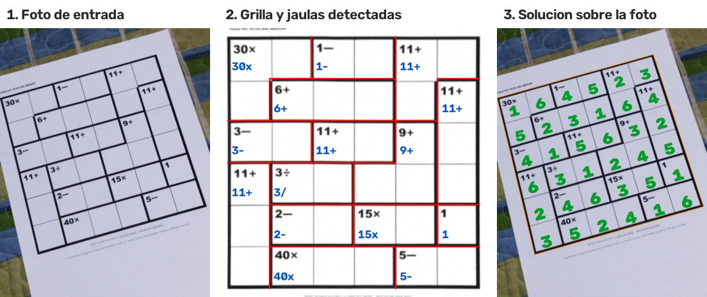
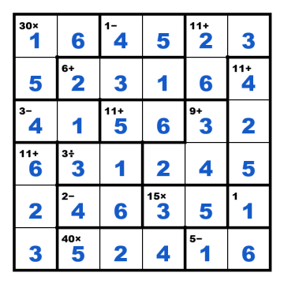

# KenKen — Visión Computacional + Programación con Restricciones

**CC58 · Tópicos en Ciencias de la Computación · 2026-2 · Trabajo 1 (Constraint Programming)**

Sistema *end-to-end* que recibe la **foto o el PDF de un KenKen**, lo **lee con visión computacional**
(grilla, jaulas, números y operaciones), lo **resuelve con un modelo de programación con restricciones**
(OR-Tools CP-SAT) y **dibuja la solución sobre la foto**. Se usa desde una **API web** (FastAPI, para la
interfaz Next.js) o desde una **línea de comandos** (`kenken`) que se comporta exactamente igual.



> Este README es la **única fuente de verdad** del proyecto: instalación, funcionamiento, modelo CP,
> contrato de la API, datos y resultados están aquí. Los README de las subcarpetas solo apuntan a este.

## Contenido

1. [Entregables y rúbrica](#1-entregables-y-rúbrica)
2. [Inicio rápido](#2-inicio-rápido)
3. [Arquitectura](#3-arquitectura)
4. [Fase 1 — Visión computacional](#4-fase-1-visión-computacional-e-ia-extracción-de-datos)
5. [Fase 2 — Programación con restricciones](#5-fase-2-constraint-programming-modelado-y-resolución)
6. [Fase 3 — Integración y visualización](#6-fase-3-integración-y-visualización)
7. [Interfaces: CLI y API](#7-interfaces-cli-y-api)
8. [Datos](#8-datos)
9.  [Resultados](#9-resultados)
10. [Limitaciones y trabajo futuro](#10-limitaciones-y-trabajo-futuro)
11. [Desarrollo](#11-desarrollo)
12. [Referencias](#12-referencias)

---


## 1. Entregables y rúbrica

| Entregable | Dónde |
|---|---|
| Código fuente + README con instalación y ejecución | este repositorio · [Inicio rápido](#2-inicio-rápido) |
| Dataset de prueba (≥ 10 imágenes, distintas condiciones) | `data/` · 30 reales (12 PDF + 18 fotos) + 28 sintéticas · [Datos](#8-datos) |
| Informe técnico (LaTeX, formato artículo) | _pendiente: enlace al PDF_ |
| Video demostrativo (≤ 5 min) | _pendiente: enlace al video_ |

| Criterio de la rúbrica | Pts | Cómo se cumple |
|---|---|---|
| Precisión en la detección de grilla, números y símbolos | 3 | Pipeline de visión ([§4](#4-fase-1-visión-computacional-e-ia-extracción-de-datos)); test: 100% grilla, jaulas y pistas ([§9](#9-resultados)) |
| Diferentes condiciones de imagen | 1 | Fotos con perspectiva, rotación, fondo y luz variable + PDFs + sintéticas con aumentaciones ([§8](#8-datos)) |
| Correcta formulación del problema matemático | 3 | Modelo formal X, D, C ([§5.1](#51-modelo-formal-csp)) |
| Uso eficiente de restricciones globales | 3 | `AllDifferent`, suma, multiplicación y tabla; con tabla la propagación resuelve sin búsqueda ([§5.4](#54-codificaciones-de-las-jaulas-arith-vs-table), [§9.3](#93-rendimiento-del-solver)) |
| Restricciones reificadas (o justificar por qué no) | 1 | Necesarias para `−`, `÷`, operación ilegible y el COP de corrección ([§5.3](#53-por-qué-se-necesitan-restricciones-reificadas)) |
| Puente IA → CP sin intervención manual | 1 | `solve-image`: foto → JSON → modelo CP → solución, automático ([§6](#6-fase-3-integración-y-visualización)) |
| Solución mostrada visualmente de forma clara | 1 | Solución proyectada sobre la foto + tablero limpio + vista de depuración ([§6](#6-fase-3-integración-y-visualización)) |
| Código limpio, modular y buenas prácticas | 2 | Capas (core / vision / service / api / cli / data), tipado, tests, lint ([§3](#3-arquitectura), [§11](#11-desarrollo)) |
| Informe técnico en LaTeX | 5 | _pendiente_ |

---

## 2. Inicio rápido

### Requisitos

- **Python ≥ 3.10** (probado con 3.14) y `git`.
- Windows, macOS o Linux. No se necesita Tesseract ni GPU.
- ~450 MB de dependencias (OpenCV, OR-Tools, PyMuPDF, FastAPI).

### Instalación

```bash
git clone <url-del-repositorio> CC-kenken
cd CC-kenken
python -m venv .venv

# activar el entorno
.venv\Scripts\Activate.ps1          # Windows PowerShell
.venv\Scripts\activate.bat          # Windows cmd
source .venv/bin/activate           # macOS / Linux

pip install -r requirements.txt     # dependencias + el paquete y el comando `kenken`
kenken data train-ocr               # opcional (~1 min): el modelo OCR ya viene en backend/models/
```

### Primer uso

```bash
# resolver una foto: imprime el puzzle leído y la solución, y guarda las imágenes
kenken solve-image data/primary/printed/6x6/3.jpeg --out output

# lo mismo con un PDF
kenken solve-image data/primary/digital/8x8/1.pdf --out output

# levantar la API web (documentación interactiva en http://127.0.0.1:8000/docs)
kenken serve
```

Salida de `solve-image` (resumida):

```text
Puzzle 6x6 · 15 cages · vision 957 ms
    #  clue   ocr      conf  cells
    1  30×    "30x"    1.00  (0,0) (0,1) (1,0)
    ...
Status OPTIMAL · unique · solver 26.6 ms (arith, 0 branches, 0 conflicts)
    1 6 4 5 2 3
    ...
Total 1203 ms (vision 957 ms, solver 26.6 ms)
  saved output/3_solveimage.json
  saved output/3_overlay.png       ← solución sobre la foto
  saved output/3_board.png         ← tablero limpio con la solución
  saved output/3_debug.png         ← lo que detectó la visión
```

### Problemas comunes

| Problema | Solución |
|---|---|
| PowerShell no deja activar el entorno | `Set-ExecutionPolicy -Scope CurrentUser RemoteSigned` |
| `kenken: command not found` | Activar el entorno virtual, o usar `python -m kenken ...` |
| El primer comando tarda ~1 min | Falta el modelo OCR: se construye en memoria. Ejecutar `kenken data train-ocr` una vez |
| OCR menos preciso en Linux/macOS | No están Arial Black / Trebuchet; `train-ocr` igual aprende de los glifos reales de los PDFs del repo |
| `extraction_failed: Could not find a KenKen grid` | La grilla debe verse completa; probar con mejor luz o menos inclinación |

---

## 3. Arquitectura

```
foto / PDF ──► Fase 1: visión ──► puzzle (JSON) ──► Fase 2: modelo CP ──► solución ──► Fase 3: imágenes
                   │                                     ▲
                   └── lecturas alternativas del OCR ────┘  (COP de corrección si la lectura es infactible)
```

Una **capa de servicio** implementa los tres casos de uso; la **API** y la **CLI** son adaptadores delgados
sobre ella, por eso devuelven el mismo JSON:

```
               ┌──────────────┐     ┌──────────────┐
  Next.js ───► │ API FastAPI  │     │  CLI kenken  │ ◄─── terminal
               └──────┬───────┘     └──────┬───────┘
                      └────────┬───────────┘
                        ┌──────▼───────┐   schemas.py: contrato JSON (Pydantic)
                        │  service.py  │   extract() · solve() · solve_image()
                        └──────┬───────┘
          ┌────────────────────┼─────────────────────┐
     ┌────▼─────┐        ┌─────▼─────┐         ┌─────▼─────┐
     │ vision/  │        │ core/cp   │         │  data/    │
     │ Fase 1,3 │        │ Fase 2    │         │ datasets  │
     └──────────┘        └───────────┘         └───────────┘
```

### Estructura del repositorio

```
CC-kenken/
├── README.md                    ← este documento (fuente única de verdad)
├── backend/
│   ├── pyproject.toml           dependencias, comando `kenken`, configuración de pytest/ruff
│   ├── kenken/
│   │   ├── schemas.py           modelos Pydantic: contrato JSON de API y CLI
│   │   ├── service.py           casos de uso: extract(), solve(), solve_image()
│   │   ├── api/                 app FastAPI (rutas, errores, CORS)
│   │   ├── cli/                 CLI Typer (comandos espejo, comandos de datos, salida legible)
│   │   ├── core/
│   │   │   ├── puzzle.py        modelo de datos Puzzle / Cage y validación
│   │   │   ├── cp.py            Fase 2: modelo CP-SAT (estilo del curso) y COP
│   │   │   ├── render.py        dibujo de tableros
│   │   │   ├── generator.py     puzzles aleatorios con solución única + aumentaciones tipo foto
│   │   │   └── fonts.py         fuentes del sistema
│   │   ├── vision/              Fase 1: preprocess, grid, ocr, extract · Fase 3: overlay
│   │   └── data/                dataset, manifiesto, etiquetas de PDF, ingesta, OCR, evaluación, benchmark
│   ├── tests/                   tests de CP, servicio, paridad API = CLI y consistencia del dataset
│   └── models/                  modelo OCR entrenado (generado, no versionado)
├── frontend/                    interfaz Next.js (consume la API, §7.3)
├── data/                        datasets primario y secundario con etiquetas (§8)
└── docs/img/                    figuras de este README
```

---

## 4. Fase 1: Visión Computacional e IA (Extracción de Datos)

Código: `backend/kenken/vision/`. Entrada: imagen (`.png .jpg .jpeg .webp .bmp`) o PDF (primera página
rasterizada a 200 dpi). Salida: el puzzle en JSON (`size`, `cages`) + lecturas alternativas de cada pista.

| # | Paso | Técnica | Archivo |
|---|---|---|---|
| 1 | Preprocesamiento | escala de grises, corrección de iluminación (división por el fondo estimado con *closing* + desenfoque), binarización adaptativa | `preprocess.py` |
| 2 | Localizar la grilla | componente conexa de tinta con más tinta **dentro** de su envolvente (descarta bordes de hoja y mesa) → 4 esquinas | `preprocess.py` |
| 3 | Corrección de perspectiva | homografía de las 4 esquinas a un cuadrado de 900×900 px | `preprocess.py` |
| 4 | Tamaño N | para N = 3…9 se mide la cobertura de líneas en las posiciones k·900/N (umbral adaptado al ruido); se elige el mayor N con todas sus líneas presentes | `grid.py` |
| 5 | Bordes gruesos vs delgados | "masa de tinta" de cada borde entre celdas (perfil perpendicular) y 2-medias en escala log, con el borde exterior como referencia de grueso | `grid.py` |
| 6 | Jaulas | *union-find*: celdas separadas por borde delgado pertenecen a la misma jaula; una jaula sin pista indica un borde mal clasificado y se fusiona por su borde más débil | `grid.py`, `extract.py` |
| 7 | Lectura de pistas (OCR) | ver abajo | `ocr.py` |
| 8 | Reparación | lecturas imposibles para la jaula (p. ej. `−` en 3 celdas o `2+` en dos celdas de una fila) → operación desconocida `?` | `extract.py` |

### OCR propio de pistas

No se usa Tesseract ni un modelo preentrenado: una pista de KenKen tiene solo 15 símbolos (`0–9 + − × / ÷`)
y siempre la forma *número + operación*, así que un clasificador específico es más preciso.

1. **Recorte y binarización**: zona superior izquierda de la celda, reescalada a tamaño fijo; umbral de Otsu
   calculado solo en la zona del texto (las líneas gruesas no lo sesgan).
2. **Segmentación en glifos**: componentes conexas; se descartan restos de líneas y se unen piezas
   superpuestas en horizontal (los puntos y la barra de `÷`).
3. **Segmentación por reconocimiento**: si una componente es ancha (dígitos o dígito + guion que se tocan,
   p. ej. `3—`), se prueban varios cortes en columnas con poca tinta y el clasificador + la gramática eligen
   el mejor (`SPLIT_PENALTY = 1.4`).
4. **Descriptor**: mapa de bits 20×20 del glifo (conservando proporción) + 5 rasgos geométricos relativos al
   glifo más alto (proporción, alto, ancho, densidad de tinta, posición vertical).
5. **Clasificador k-NN** (k = 5, votos ponderados por distancia) → probabilidad de cada una de las 15 clases.
6. **Gramática `dígitos+ [op]`**: todos los glifos menos el último son dígitos; el último es operación si la
   jaula tiene más de una celda. Se generan las **8 lecturas más probables** con costo −log p.

**Entrenamiento** (`kenken data train-ocr`, modelo en `backend/models/ocr_glyphs.npz`): 11 938 glifos
sintéticos dibujados con las fuentes instaladas (incluidas Arial Black y Trebuchet MS Bold, las de
kenkenpuzzle.com) con rotación, desenfoque, ruido y baja resolución, + 467 glifos reales del split `dev`
(PDFs, etiquetas exactas). Las fotos del split `test` nunca se usan para entrenar.

---

## 5. Fase 2: Constraint Programming (Modelado y Resolución)

Código: `backend/kenken/core/cp.py`, escrito con la estructura de los códigos del curso
(`#crear CSP`, `#variables y dominios`, `#restricciones`, `#función objetivo`, `#crear solver`).

### 5.1 Modelo formal (CSP)

- **X**: `grilla[i][j]`, el valor de la celda (i, j), para i, j ∈ {0, …, N−1}.
- **D**: `grilla[i][j] ∈ {1, …, N}`.
- **C1**: `AllDifferent(grilla[i][0..N−1])` para cada fila i (global).
- **C2**: `AllDifferent(grilla[0..N−1][j])` para cada columna j (global).
- **C3**: para cada jaula J con objetivo t:

| Operación | Restricción | Tipo |
|---|---|---|
| `=` (1 celda) | x = t | unaria |
| `+` | Σ xₖ = t | suma (global) |
| `×` | Π xₖ = t (`AddMultiplicationEquality`) | multiplicación (global) |
| `−` (2 celdas) | b ⇒ a − c = t ; ¬b ⇒ c − a = t | **reificada** |
| `÷` (2 celdas) | b ⇒ a = t·c ; ¬b ⇒ c = t·a | **reificada** |
| `?` (ilegible) | un booleano por operación candidata, `ExactlyOne`, cada restricción reificada en su booleano | **reificada** |

El modelo es **parametrizado**: se construye desde el JSON para cualquier N (3–9) y cualquier conjunto de
jaulas. C1 + C2 son exactamente el **cuadrado latino** del curso; KenKen agrega C3.

```python
#variables y dominios
grilla = []
for i in range(n):
    fila = []
    for j in range(n):
        fila += [model.NewIntVar(1, n, 'x' + str(i) + '_' + str(j))]
    grilla += [fila]
#restricciones
for i in range(n):
    model.AddAllDifferent(grilla[i])                          # C1
for j in range(n):
    model.AddAllDifferent([grilla[i][j] for i in range(n)])   # C2
```

### 5.2 Resolución y unicidad

- **Una solución + walltime**: `cp_model.CpSolver()`, `Solve`, estado `OPTIMAL`/`FEASIBLE`, tiempo con
  `solver.WallTime()`, límite de tiempo y 8 *workers*.
- **Todas las soluciones**: `ContadorSoluciones` (patrón `VarArraySolutionPrinter` del curso) con
  `enumerate_all_solutions` (forma actual de `SearchForAllSolutions`); se detiene con `StopSearch()` al
  encontrar **2 soluciones distintas**, porque eso ya prueba que no es única. Un KenKen real tiene solución
  única: `unique = false` indica casi siempre una pista mal leída.

### 5.3 Por qué se necesitan restricciones reificadas

1. **`−` y `÷`**: la pista "2÷" no dice cuál celda es la mayor; "a/c = t" no es una restricción lineal
   entera. Un booleano `orden` elige el caso y cada caso se exige con `OnlyEnforceIf(orden)` /
   `OnlyEnforceIf(orden.Not())`, igual que en `pc2_04-reificacion.py`.
2. **Operación ilegible**: si el OCR no lee el símbolo, el modelo decide la operación (un booleano por
   operación, `ExactlyOne`, restricción reificada). `AddMultiplicationEquality` no acepta `OnlyEnforceIf`,
   así que se reifica con una variable auxiliar `producto`.
3. **COP de corrección** (§5.5): cada lectura alternativa se activa con su booleano.

### 5.4 Codificaciones de las jaulas: `arith` vs `table`

- **`arith`** (por defecto): las restricciones de la tabla de §5.1.
- **`table`**: cada jaula es una restricción de tabla (`AddAllowedAssignments`) con todas las tuplas que
  cumplen la aritmética y son distintas en celdas de la misma fila o columna → **consistencia de arco
  generalizada** por jaula. Con esta codificación la propagación resuelve todas las instancias del
  benchmark **sin ramificar** ([§9.3](#93-rendimiento-del-solver)).

### 5.5 COP: la restricción corrige a la visión

Si la lectura más probable no tiene solución, se resuelve un **problema de optimización con restricciones**:

- X, D, C1, C2 como arriba; cada jaula k tiene lecturas candidatas a con costo c_ka = −log p (del OCR).
- y_ka ∈ {0, 1}: `ExactlyOne(y_k*)` y `y_ka ⇒ C3(lectura a)` (reificada).
- **Función objetivo**: minimizar Σ c_ka · y_ka.

Resultado: la lectura más probable de la foto que es un KenKen válido. La API devuelve los cambios en
`corrections` (estructura análoga al COP de coloreo mínimo de `21_2_topicoscc_4.py`).

### 5.6 Otros usos de CP en el sistema

| Uso | Dónde |
|---|---|
| Descartar lecturas del OCR imposibles para su jaula (enumeración de tuplas válidas) | `vision/extract.py` |
| Generar puzzles sintéticos con **solución única** | `core/generator.py` |
| Validar etiquetas: cada etiqueta verificada tiene solución única igual a la guardada | `data/ingest.py`, `tests/test_data.py` |
| Hacer concreta la operación `?` según la solución (para mostrarla) | `core/puzzle.py`, `service.py` |
| Medir el solver por N y codificación | `data/bench.py` (`kenken bench`) |

### 5.7 Técnicas del curso utilizadas

| Técnica del curso | Origen | En el proyecto |
|---|---|---|
| `CpModel`, `NewIntVar`, `Add`, `CpSolver`, estado `OPTIMAL/FEASIBLE` | todos los códigos | `cp.py` |
| Cuadrado latino con `grilla`/`fila` y `AddAllDifferent` en filas y columnas | `26_2_topicoscc_3.py` | C1, C2 |
| Restricciones de suma `Add(sum(...) == s)` | Cuadrado mágico, Winter School | jaulas `+`, objetivo del COP |
| Restricciones globales | criptograma, cuadrado latino, Obra (`AddCumulative`) | `AllDifferent`, multiplicación, tabla |
| Reificación `OnlyEnforceIf(b)` / `OnlyEnforceIf(b.Not())` | `pc2_04-reificacion.py`, `usocolor` | `−`, `÷`, `?`, COP |
| Booleanos one-hot enlazados con `OnlyEnforceIf` | `nc[i][j]` en `21_2_topicoscc_4.py` | elección de operación y de lectura |
| COP con `Minimize` | coloreo mínimo, `21_2_topicoscc_4.py` | COP de corrección |
| `VarArraySolutionPrinter` + todas las soluciones, "¿es ÚNICA?" | `26_2...`, PC2 | `ContadorSoluciones` |
| Una solución + walltime (`WallTime`) | PC2 | `ResultadoCP.walltime`, `kenken bench` |
| Problema formal X, D, C en el encabezado (unaria, binaria, n-aria) | `pc2_02-hijkCSP.py`, diapositivas | encabezado de `cp.py` |
| Funciones auxiliares que agregan restricciones | `no_simultaneo`, `before` | `agregar_operacion`, `agregar_jaula` |
| Propagación / forward checking, backtracking | diapositivas (Sudoku) | dentro de CP-SAT; visible en `branches`/`conflicts` |

No se usan intervalos/`AddCumulative` ni ruteo (TSP) porque KenKen no es un problema de planificación
ni de rutas; no se implementó fuerza bruta/backtracking propio como línea base.

---

## 6. Fase 3: Integración y Visualización

- **Integración automática**: `solve_image()` encadena visión → JSON → modelo CP (→ COP si hace falta)
  sin intervención manual; lo usan igual la API y la CLI.
- **Solución sobre la foto**: los dígitos se dibujan en el plano rectificado y se proyectan a la foto
  original con la **homografía inversa**, siguiendo la perspectiva del papel (`vision/overlay.py`).
- **Tablero limpio**: la grilla redibujada con pistas y solución (`core/render.py`).
- **Vista de depuración**: grilla rectificada con los bordes gruesos detectados (rojo) y las lecturas (azul).



---

## 7. Interfaces: CLI y API

Cada acción de la interfaz web es **un endpoint** y **un comando**, con el mismo nombre, las mismas opciones y
**el mismo JSON** (un test lo verifica):

| Acción | API | CLI |
|---|---|---|
| Leer el puzzle de una foto/PDF | `POST /api/extract` | `kenken extract ARCHIVO` |
| Resolver un puzzle (p. ej. tras editarlo) | `POST /api/solve` | `kenken solve PUZZLE.json` |
| Todo en un paso | `POST /api/solve-image` | `kenken solve-image ARCHIVO` |
| Versión / estado | `GET /api/health` | `kenken --version` |

### 7.1 CLI

```
kenken extract ARCHIVO        Fase 1: imagen/PDF -> puzzle
kenken solve PUZZLE.json      Fase 2: puzzle -> solución
kenken solve-image ARCHIVO    Fases 1-3: imagen/PDF -> solución sobre la imagen
kenken serve                  levantar la API          (--host, --port, --reload)
kenken bench                  benchmark del solver     (--sizes 4,5,6,7,8,9 --count 10 --seed 0 --json)
kenken data ingest            crear etiquetas faltantes y el manifiesto   (--redo-drafts)
kenken data list              listar muestras          (--split, --source, --json)
kenken data review [IDs]      imagen + etiqueta lado a lado para revisarla (--unverified, -o DIR)
kenken data synth             generar el dataset sintético (--count 28 --seed 0)
kenken data train-ocr         entrenar el OCR          (--dev/--fonts-only)
kenken data eval              métricas contra las etiquetas (--split, --source, --include-unverified, -v, --json)
```

Opciones comunes de `extract`, `solve` y `solve-image` (mismos nombres que los parámetros de la API):

| Opción | Significado | Por defecto |
|---|---|---|
| `--size N` | fijar el tamaño de la grilla (3–9) en vez de detectarlo | detectar |
| `--encoding arith\|table` | codificación de las jaulas | `arith` |
| `--time-limit S` | límite de tiempo del solver (s) | 30 |
| `--unique / --no-unique` | verificar que la solución sea única | `--unique` |
| `--images` | incluir imágenes (PNG base64) en la respuesta | no |
| `--json` | imprimir exactamente el cuerpo de respuesta de la API | no |
| `--out DIR`, `-o DIR` | guardar el JSON y las imágenes como archivos | — |

`kenken solve` acepta un puzzle (`{"size", "cages"}`, también los archivos de etiqueta) o un cuerpo
`SolveRequest` (`{"puzzle", "options"}`). **Códigos de salida**: `0` ok · `1` sin solución ·
`2` entrada inválida · `3` no se encontró la grilla · `4` puzzle inválido. No se abren ventanas emergentes.

```bash
kenken extract data/primary/digital/8x8/1.pdf --json > puzzle.json   # leer, editar si hace falta...
kenken solve puzzle.json                                              # ...y resolver
kenken solve-image foto.jpg --encoding table --out output             # todo en un paso
```

### 7.2 API (contrato)

`kenken serve` → `http://127.0.0.1:8000` · documentación interactiva `/docs` · esquema `/openapi.json`.

**Convenciones**

- Celdas `[fila, columna]`, desde 0, fila 0 arriba; `grid[fila][columna]` es el valor de la celda.
- Operaciones (`op`): `"+"`, `"-"`, `"*"`, `"/"`, `"="` (jaula de una celda), `"?"` (desconocida, la infiere
  el solver). Mostrarlas como `+ − × ÷` (nada para `=`).
- Tiempos en milisegundos. Imágenes como *data URL* PNG (`data:image/png;base64,...`), usables en ``;
  solo se devuelven con `?images=true`.
- Subida: `multipart/form-data` con un campo `file` (`.png .jpg .jpeg .webp .bmp .pdf`), máximo 15 MB.

#### `POST /api/extract`

Query: `size` (3–9, opcional), `images` (bool).

```bash
curl -F "file=@foto.jpg" "http://127.0.0.1:8000/api/extract"
```

Respuesta `ExtractResponse` (salida real, jaulas recortadas):

```json
{
  "puzzle": {"size": 4, "cages": [
    {"target": 2, "op": "/", "cells": [[0, 0], [1, 0]]},
    {"target": 3, "op": "+", "cells": [[0, 1], [0, 2]]}
  ]},
  "detections": [
    {"clue_cell": [0, 0], "ocr_text": "2÷", "confidence": 1.0},
    {"clue_cell": [0, 1], "ocr_text": "3+", "confidence": 1.0}
  ],
  "grid_corners": [[114.0, 188.6], [1495.5, 188.6], [1494.0, 1574.4], [114.0, 1573.0]],
  "image_size": [1653, 2339],
  "warnings": [],
  "timings": {"vision_ms": 439.29},
  "images": null
}
```

- `detections[i]` describe `puzzle.cages[i]`: celda de la pista, texto crudo del OCR (`x` = ×, `-` = −) y
  confianza (para resaltar jaulas dudosas en la interfaz).
- `grid_corners`: esquinas de la grilla en píxeles de la imagen subida (sup-izq, sup-der, inf-der, inf-izq);
  para PDFs la imagen es la página rasterizada a 200 dpi.
- `images.debug` (con `images=true`): grilla rectificada con bordes y lecturas detectadas.

#### `POST /api/solve`

Query: `images` (bool). Cuerpo `SolveRequest` (`options` es opcional; se muestran los valores por defecto):

```json
{
  "puzzle": {"size": 4, "cages": [{"target": 2, "op": "/", "cells": [[0, 0], [1, 0]]}]},
  "options": {"encoding": "arith", "time_limit": 30, "check_unique": true}
}
```

Respuesta `SolveResponse` (salida real, jaulas recortadas):

```json
{
  "status": "OPTIMAL",
  "solved": true,
  "grid": [[4, 2, 1, 3], [2, 1, 3, 4], [3, 4, 2, 1], [1, 3, 4, 2]],
  "unique": true,
  "puzzle": {"size": 4, "cages": ["..."]},
  "stats": {"encoding": "arith", "wall_time_ms": 10.17, "branches": 0, "conflicts": 0,
            "num_variables": 22, "num_constraints": 22},
  "images": null
}
```

- `status`: `OPTIMAL`/`FEASIBLE` (resuelto), `INFEASIBLE` (pistas contradictorias: `solved: false`,
  `grid: null`), `UNKNOWN` (límite de tiempo).
- `unique`: `true` / `false` / `null` (no verificado o sin tiempo).
- `puzzle`: el puzzle resuelto, con las operaciones `?` reemplazadas por la que cumple la solución.
- `images.board` (con `images=true`): tablero limpio con la solución.

#### `POST /api/solve-image`

Query: `size`, `encoding`, `time_limit`, `check_unique`, `images`. Respuesta `SolveImageResponse`
(estructura; valores ilustrativos):

```json
{
  "extraction": {"...": "ExtractResponse"},
  "solution": {"...": "SolveResponse"},
  "corrections": [{"cell": [0, 4], "read": "30−", "corrected": "3−"}],
  "timings": {"vision_ms": 957.0, "solver_ms": 26.6, "total_ms": 1203.0},
  "images": {"overlay": "data:image/png;base64,...", "board": "data:...", "debug": "data:..."}
}
```

- `corrections`: pistas cambiadas por el COP (§5.5); conviene mostrarlas al usuario.
- `extraction.puzzle` es el puzzle ya corregido; `extraction.detections` conserva el OCR crudo.

#### `GET /api/health`

`{"status": "ok", "version": "1.0.0"}`

#### Errores

Todos los errores tienen la forma `ErrorResponse`:

```json
{"error": "invalid_input", "message": "Cannot decode image 'notas.txt' (supported: .png, ...)"}
```

| HTTP | `error` | Cuándo | Código de salida CLI |
|---|---|---|---|
| 400 | `invalid_input` | archivo vacío, ilegible o > 15 MB | 2 |
| 422 | `extraction_failed` | no se encontró una grilla de KenKen | 3 |
| 422 | `invalid_puzzle` | puzzle inconsistente (celdas repetidas o faltantes, `−`/`÷` sin 2 celdas, …) | 4 |
| 422 | (lista `detail` de FastAPI) | la petición no cumple el esquema (p. ej. `size: 12`) | 2 |
| 200 | — | puzzle válido sin solución: `solved: false` | 1 |

### 7.3 Frontend (Next.js)

```bash
# .env.local
NEXT_PUBLIC_API_URL=http://127.0.0.1:8000

# tipos TypeScript generados desde el esquema del backend (repetir si la API cambia)
npx openapi-typescript http://127.0.0.1:8000/openapi.json -o src/lib/kenken-api.d.ts
```

```ts
import type { components } from "@/lib/kenken-api";
type SolveImageResponse = components["schemas"]["SolveImageResponse"];

export async function solveImage(file: File): Promise<SolveImageResponse> {
  const body = new FormData();
  body.append("file", file);
  const res = await fetch(`${process.env.NEXT_PUBLIC_API_URL}/api/solve-image?images=true`, {
    method: "POST",
    body,
  });
  if (!res.ok) throw new Error((await res.json()).message ?? res.statusText);
  return res.json();
}
```

**Flujos recomendados**

- **Un clic**: `POST /api/solve-image?images=true` → mostrar `images.overlay` o `images.board`.
- **Con revisión del usuario** (recomendado): `POST /api/extract` → dibujar `puzzle` editable y resaltar
  jaulas con `confidence` baja → el usuario corrige → `POST /api/solve` → mostrar `grid`.
- Mostrar `corrections` y avisar si `unique === false` (probable pista mal leída).

**CORS**: por defecto se permite `http://localhost:3000`. Para otros orígenes:
`KENKEN_CORS_ORIGINS="https://mi-app.vercel.app,http://localhost:3000"` antes de `kenken serve`.

### 7.4 Despliegue serverless (Vercel)

El repo se despliega como **un solo proyecto Vercel con dos servicios** (`vercel.json` en la
raíz): `backend` (FastAPI como Vercel Function, detectada vía `backend/index.py` que reexporta
`kenken.api:app`) y `frontend` (Next.js). Los rewrites enrutan `/api/*` al backend y todo lo
demás al frontend, así que la web llama a la API en el **mismo origen**: no hace falta
`NEXT_PUBLIC_API_URL` ni CORS en producción. `/docs` y `/openapi.json` también van al backend,
por lo que la documentación interactiva queda pública.

No se requieren variables de entorno en Vercel. Para desarrollo local, `frontend/.env.local`
apunta `NEXT_PUBLIC_API_URL=http://127.0.0.1:8000` al `kenken serve` de siempre.

Archivos involucrados (ya en el repo):

- `vercel.json` (raíz) — servicios, memoria/duración de la función Python y rewrites públicos.
- `backend/index.py` — entrypoint ASGI que Vercel reconoce (`app`); `kenken serve` sigue
  funcionando igual para desarrollo local.
- `backend/.vercelignore` — no sube `tests/`, cachés ni artefactos de build.
- `backend/models/ocr_glyphs.npz` — el modelo OCR **sí se versiona** (a diferencia del resto de
  `backend/models/`): el contenedor de Vercel no tiene las fuentes de Windows para reentrenarlo.
- `opencv-python-headless` en vez de `opencv-python` (no se usa ninguna función de GUI).

**Límites de Vercel que importan aquí** (plan Hobby):

- **4.5 MB por petición/respuesta**: el cliente (`frontend/src/lib/api.ts`, `prepareUpload`)
  recomprime en el navegador las fotos que superen ese tamaño (reescala a 2000 px de lado mayor y
  baja la calidad JPEG) antes de subirlas; los PDF no se pueden recomprimir, así que uno muy
  pesado puede fallar con un error 413 (mensaje ya traducido en la interfaz).
- **500 MB de paquete** (Python): `ortools` + `opencv-python-headless` + `numpy` + `pymupdf`
  entran holgados.
- **Arranque en frío** (~2-4 s, primera petición tras inactividad): el `lifespan` de la API ya
  precarga el clasificador OCR; la página del solver hace *ping* a `/api/health` al abrir, lo que
  calienta la función antes de que el usuario suba un archivo.

Si el volumen de imágenes pesadas o PDFs es alto y estos límites quedan cortos, el mismo backend
corre sin cambios en Google Cloud Run o Render (contenedor con `uvicorn kenken.api:app`).

---

## 8. Datos

| Carpeta | Origen | Muestras | Split | Etiquetas |
|---|---|---|---|---|
| `data/primary/digital/` | PDFs de kenkenpuzzle.com | 12 (4×4, 6×6, 8×8 · 4 c/u; fácil y medio) | `dev` | exactas, leídas del contenido vectorial del PDF |
| `data/primary/printed/` | fotos con celular de puzzles impresos | 18 (4×4, 6×6, 8×8 · 6 c/u) | `test` | borrador de la visión revisado a mano |
| `data/secondary/synthetic/` | generadas (`kenken data synth`) | 28 (3×3 … 9×9) | `synthetic` | exactas (generador) |

- **Primario = fuente principal**: las métricas del informe son las del split `test`.
- **Condiciones de las fotos** (~960×1280 px): de frente con leve perspectiva y luz azulada sobre fondo claro,
  e inclinadas y rotadas sobre un fondo con textura; en las de 8×8 el texto de las pistas es pequeño.
- **Sintéticas**: estilos aleatorios (fuente, grosor de líneas, líneas grises, `× ÷ −` o `x / -`) y cuatro
  niveles de aumentación (`none`, `light`, `medium`, `hard`: fondo, perspectiva, rotación, iluminación
  irregular, desenfoque, ruido, JPEG). Generación determinista por semilla.

**Splits y reglas**

- `dev` puede usarse para ajustar y entrenar el OCR (sus glifos alimentan `train-ocr`).
- `test` no se usa para entrenar ni ajustar (ver la nota de evaluación en [§9.1](#91-precisión)).
- `synthetic` es para pruebas de estrés y para ajustar parámetros.
- Los archivos originales nunca se modifican; cada muestra tiene una etiqueta hermana `<k>.json`.

### 8.1 Estructura y manifiesto

```
data/
  manifest.json                         índice de todas las muestras (kenken data ingest)
  primary/digital/<N>x<N>/<k>.pdf       + <k>.json
  primary/printed/<N>x<N>/<k>.jpeg      + <k>.json
  secondary/synthetic/<N>x<N>/<k>.jpg   + <k>.json
```

Identificadores: `<fuente>-<N>x<N>-<k>`, p. ej. `printed-8x8-02`. La carpeta de datos se puede cambiar
con la variable de entorno `KENKEN_DATA`.

### 8.2 Formato de etiqueta

El mismo esquema de puzzle de la API, más la solución y metadatos:

```json
{
  "size": 4,
  "cages": [{"target": 2, "op": "/", "cells": [[0, 0], [1, 0]]}],
  "solution": [[4, 2, 1, 3], [2, 1, 3, 4], [3, 4, 2, 1], [1, 3, 4, 2]],
  "meta": {"source": "digital", "label_source": "pdf", "verified": true,
           "puzzle_id": "221608", "difficulty": "easy"}
}
```

`label_source`: `pdf` (exacta), `draft` (borrador de la visión), `manual` (corregida a mano),
`generated` (sintética). Toda etiqueta verificada es un puzzle válido con **solución única igual a
`solution`** (lo comprueba `tests/test_data.py`).

### 8.3 Cómo se crearon las etiquetas

- **Digitales**: los PDFs son vectoriales: los bordes de jaula son rectángulos rellenos gruesos y las pistas
  son texto (dígitos en Arial Black, operaciones en Trebuchet MS Bold) con su posición, así que se leen
  exactamente (`data/pdf_labels.py`) y se validan con el solver.
- **Fotos**: `kenken data ingest` genera un borrador con la visión; cada borrador se revisó contra su foto
  (`kenken data review`): cada pista y su celda, número de jaulas = número de pistas impresas, y solución
  CP única. 17/18 borradores eran correctos; `printed-8x8-02` tenía 11 pistas mal leídas y se corrigió a
  mano (`label_source: manual`).

### 8.4 Agregar datos

1. Copiar el archivo en `<N>x<N>/<k>.<ext>` dentro de la carpeta que corresponda.
2. `kenken data ingest` → crea la etiqueta (exacta para PDFs, borrador para fotos) y actualiza el manifiesto.
3. Fotos: `kenken data review <id> -o review`, corregir el JSON si hace falta y poner `"verified": true`.
4. `kenken data ingest` de nuevo para refrescar el manifiesto.

Los puzzles provienen de kenkenpuzzle.com (KenKen® es marca registrada de KenKen Puzzle LLC); se usan
solo con fines académicos.

---

## 9. Resultados

Todas las cifras se reproducen con los comandos de [§9.4](#94-reproducir).

### 9.1 Precisión

| Métrica | Definición |
|---|---|
| Tamaño | N detectado correctamente (por imagen) |
| Jaulas | partición en jaulas exactamente correcta (por imagen) |
| Bordes | bordes interiores clasificados bien como delgado/grueso (por borde) |
| Pistas | objetivo y operación leídos bien (por jaula) |
| Resuelto | la grilla devuelta resuelve el puzzle **verdadero** (por imagen, extremo a extremo) |

| Split | Imágenes | Tamaño | Jaulas | Bordes | Pistas | Resuelto |
|---|---|---|---|---|---|---|
| **test** — fotos impresas | 18 | 100% | 100% | 100% | 100% | **100%** (18/18) |
| dev — PDFs (usados para entrenar el OCR) | 12 | 100% | 100% | 100% | 100% | 100% (12/12) |
| synthetic — generadas con aumentación | 28 | 100% | 100% | 100% | 93.6% | 82.1% (23/28) |

Por tamaño, en `test`: 4×4 6/6, 6×6 6/6, 8×8 6/6.

**Nota de evaluación.** La primera evaluación del split `test` dio **17/18 (94.4%)** y 99.7% de pistas:
en `printed-8x8-02` la pista `3−` se leyó `30−` porque el dígito y el guion se tocan y se cortaban en el
lugar equivocado. Tras este análisis de error *sobre el split de test* se cambió la segmentación a
"segmentación por reconocimiento"; su único parámetro (`SPLIT_PENALTY`) se ajustó solo con los splits
`synthetic` y `dev` (en `synthetic` subió de 78.6% a 82.1% resuelto). El 18/18 ya no es una estimación
totalmente imparcial: **reportar ambas cifras**. El split `dev` es optimista porque sus glifos se usan
para entrenar el OCR.

### 9.2 Tiempos de respuesta

| Etapa | Tiempo típico |
|---|---|
| Visión (por foto, 960×1280) | ~0.5 s (4×4 más rápido, 8×8 hasta ~0.8 s); una ejecución aislada de la CLI suma ~0.5 s de carga del modelo OCR |
| Solver (resolver + verificar unicidad) | ~15–30 ms |
| COP de corrección (solo si hace falta) | hasta 10 s (límite) |

### 9.3 Rendimiento del solver

`kenken bench --count 10`: 10 puzzles aleatorios con solución única por N, resueltos con ambas
codificaciones (sin verificar unicidad).

| N | `arith` media / máx (ms) | `arith` ramas | `table` media / máx (ms) | `table` ramas | variables (arith / table) | restricciones (arith / table) |
|---|---|---|---|---|---|---|
| 4 | 15.4 / 28.1 | 0 | 11.9 / 14.1 | 0 | 17.3 / 16 | 16.1 / 14.8 |
| 5 | 25.7 / 29.0 | 0 | 21.6 / 25.7 | 0 | 27.5 / 25 | 22.9 / 20.4 |
| 6 | 25.7 / 37.1 | 0 | 21.7 / 28.5 | 0 | 39.3 / 36 | 30.4 / 27.1 |
| 7 | 39.1 / 151.4 | 358.6 | 25.0 / 68.6 | 0 | 52.4 / 49 | 37.4 / 34 |
| 8 | 41.5 / 56.8 | 0 | 33.4 / 57.7 | 0 | 68.8 / 64 | 47.0 / 42.2 |
| 9 | 57.4 / 215.5 | 423.0 | 40.8 / 109.9 | 0 | 87.8 / 81 | 58.7 / 51.9 |

- El modelo tiene N² variables de decisión, 2N restricciones `AllDifferent` y una restricción por jaula
  (dos para `−` y `÷`, que además agregan un booleano de orden cada una).
- Con `table` **la propagación sola resuelve todas las instancias (0 ramas)**: la consistencia de arco
  generalizada por jaula más `AllDifferent` basta. Con `arith`, algunas instancias de 7×7 y 9×9 requieren
  búsqueda. El costo de `table` es generar las tuplas (exponencial en el tamaño de la jaula; se limita a
  200 000 tuplas y por encima se usa `arith`).

### 9.4 Reproducir

```bash
kenken data eval --split test          # tabla de precisión (añadir -v para ver cada error)
kenken data eval --split dev
kenken data eval --split synthetic
kenken bench --sizes 4,5,6,7,8,9 --count 10
```

---

## 10. Limitaciones y trabajo futuro

- **Lecturas erróneas pero válidas**: si una pista mal leída sigue dando un puzzle con solución (p. ej. `3÷`
  leído `3+`), el sistema resuelve el puzzle equivocado. Señal disponible: `unique = false`.
- **Pistas muy pequeñas y borrosas** (9×9 con celdas de ~70 px en fotos degradadas) concentran los errores del OCR.
- **Líneas delgadas de 1 px gris claro** con degradación fuerte pueden confundir N con un divisor (~1 de 300
  casos sintéticos).
- **Test pequeño** (18 fotos) y ya usado una vez para análisis de error: conviene un set nuevo de fotos.
- **Trabajo futuro**: usar la unicidad como señal para corregir lecturas válidas pero erróneas; línea base
  de fuerza bruta / backtracking propio para comparar con CP-SAT; más fotos (otras impresoras, papel arrugado).

---

## 11. Desarrollo

```bash
cd backend
python -m pytest -q          # 30 tests: CP, servicio, paridad API = CLI, consistencia del dataset
ruff check kenken tests      # lint
```

- **Tests**: ambas codificaciones, unicidad, operación desconocida, corrección por COP, errores del servicio,
  mismo JSON en API y CLI, y que cada etiqueta verificada tenga solución única.
- **Finales de línea**: `.gitattributes` fuerza LF; el código escribe JSON con `\n` explícito.
- **Generado y no versionado**: `backend/models/`, `output/`, `review/`.
- **Variables de entorno**: `KENKEN_CORS_ORIGINS` (orígenes permitidos por la API), `KENKEN_DATA`
  (carpeta de datos).

---

## 12. Referencias

- Rossi, F., van Beek, P., Walsh, T. (2006). *Handbook of Constraint Programming*. Elsevier.
- Apt, K. R. (2003). *Principles of Constraint Programming*. Cambridge University Press.
- Perron, L., Didier, F. *CP-SAT* (Google OR-Tools). https://developers.google.com/optimization
- Cover, T., Hart, P. (1967). Nearest neighbor pattern classification. *IEEE Trans. Information Theory*, 13(1).
- Otsu, N. (1979). A threshold selection method from gray-level histograms. *IEEE Trans. SMC*, 9(1).
- Bradski, G. (2000). The OpenCV Library. *Dr. Dobb's Journal of Software Tools*.
- KenKen. https://en.wikipedia.org/wiki/KenKen · puzzles: https://www.kenkenpuzzle.com
